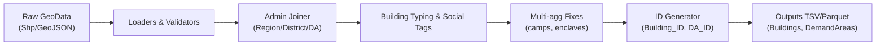
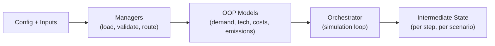
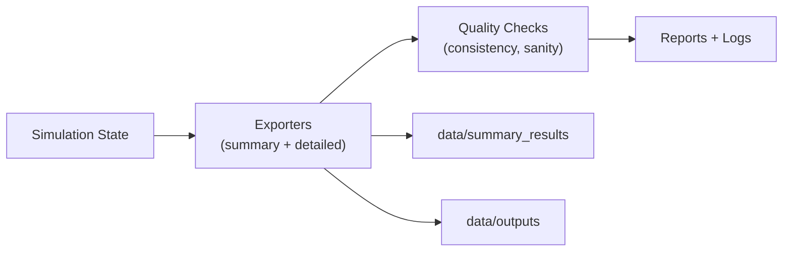

# Architecture

This section explains **what the system is made of** and **how components relate**.  
It’s split in three structural blocks:

1) **Preprocessing (Country → Building granularity)**  
2) **Core Tool (OOP models + managers + orchestration)**  
3) **Post-processing (exports, QC, analytics)**

For the step-by-step of data transformations, see **[Dataflow](/doc/01_overview/data_flow_diagram.md)**.

---

## 1) Preprocessing — Country → Building Granularity

**Goal.** Transform raw geospatial datasets (Shapefile/GeoJSON) into **structured, model-ready inputs**.

**Scope.**  
- Download / load administrative layers and building footprints.  
- Assign **building types** and **social categories** (e.g., residential, health, education).  
- Fix **multi-aggregated buildings** (e.g., refugee/military camps).  
- Attach **administrative divisions** (country → region → district → demand area).  
- Generate **stable unique IDs** per building and per demand area.  
- Optional enrichment: national surveys, **utility geodata**, electrification plan overlays.  

**Deliverables.**  
- Clean tables at **building** and **demand-area** levels (TSV/Parquet).  
- Lookups: admin codes, building type dictionaries, social category mapping.

---

## 2) Core Tool — OOP Models, Managers, Orchestration

**Goal.** Run the simulation using structured data, modeling demand, adoption, costs, emissions, and social impacts over time.

**Scope.**
- Domain models (buildings, demand areas, technologies, states).
- Managers that coordinate inputs, preprocessing outputs, and runtime configuration.
- Orchestration of the simulation loop (scenario selection, time steps, outputs).

**Deliverables.**
- In-memory simulation state per scenario and time step.
- Intermediate data used by reporting and exports.

---

## 3) Post-processing — Exports, QC, Analytics

**Goal.** Transform simulation outputs into tabular results, reports, and quality checks.

**Scope.**
- Export tables for summary and detailed outputs.
- Generate reports and logs for traceability.
- Apply consistency checks and quick validations.

**Deliverables.**
- `data/summary_results` for quick validation.
- `data/outputs` for detailed analysis.
- Reports and logs for traceability and debugging.

