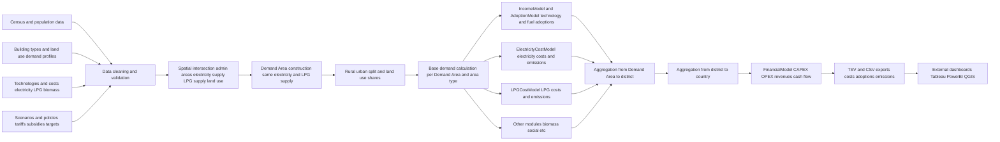

```mermaid
graph LR
    A1["Census and population data"]
    A2["Building types and land use demand profiles"]
    A3["Technologies and costs electricity LPG biomass"]
    A4["Scenarios and policies tariffs subsidies targets"]

    B1["Data cleaning and validation"]
    B2["Spatial intersection admin areas electricity supply LPG supply land use"]
    B3["Demand Area construction same electricity and LPG supply"]
    B4["Rural urban split and land use shares"]
    B5["Base demand calculation per Demand Area and area type"]

    C1["IncomeModel and AdoptionModel technology and fuel adoptions"]
    C2["ElectricityCostModel electricity costs and emissions"]
    C3["LPGCostModel LPG costs and emissions"]
    C4["Other modules biomass social etc"]

    D1["Aggregation from Demand Area to district"]
    D2["Aggregation from district to country"]

    E1["FinancialModel CAPEX OPEX revenues cash flow"]
    E2["TSV and CSV exports costs adoptions emissions"]
    E3["External dashboards Tableau PowerBI QGIS"]

    A1 --> B1
    A2 --> B1
    A3 --> B1
    A4 --> B1

    B1 --> B2 --> B3 --> B4 --> B5

    B5 --> C1
    B5 --> C2
    B5 --> C3
    B5 --> C4

    C1 --> D1
    C2 --> D1
    C3 --> D1
    C4 --> D1

    D1 --> D2 --> E1 --> E2 --> E3
``` 